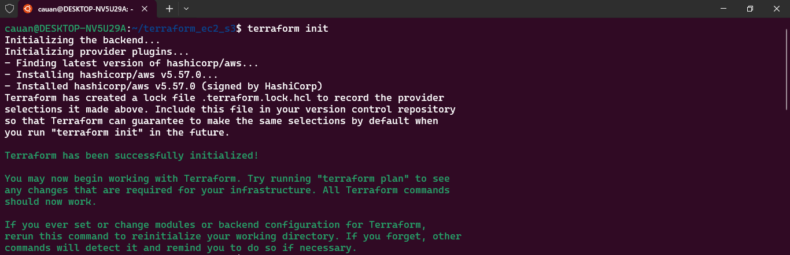
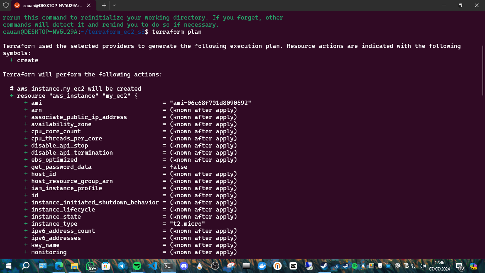
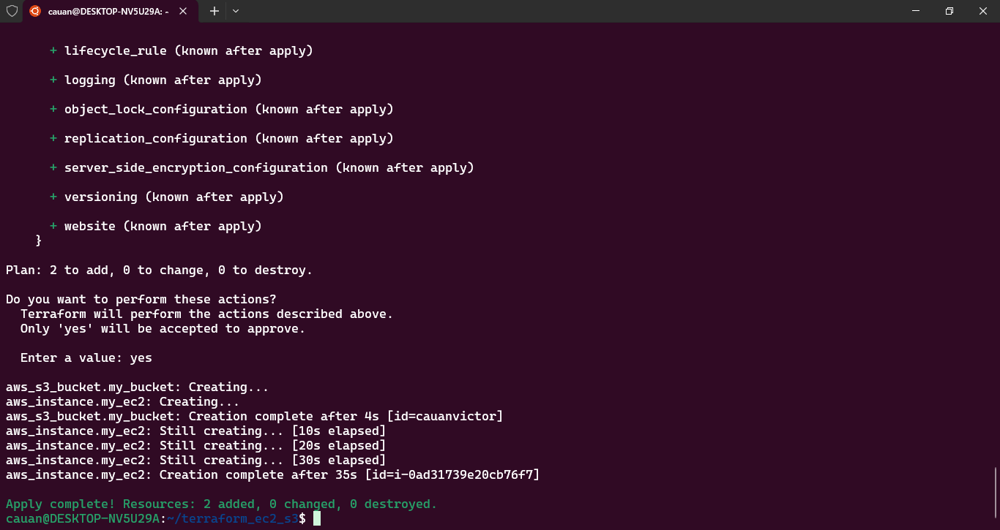
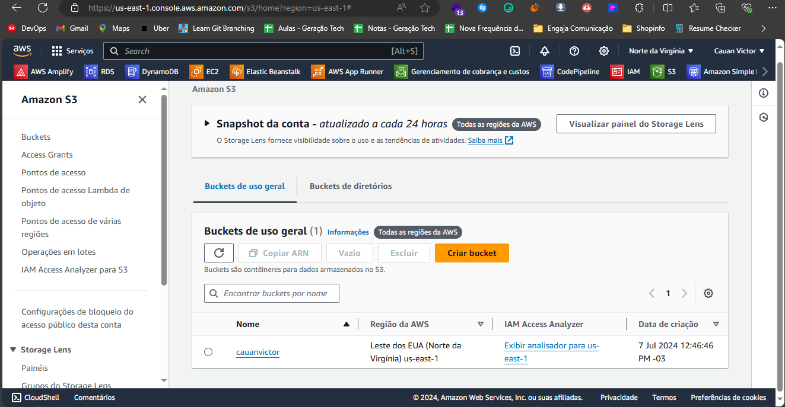
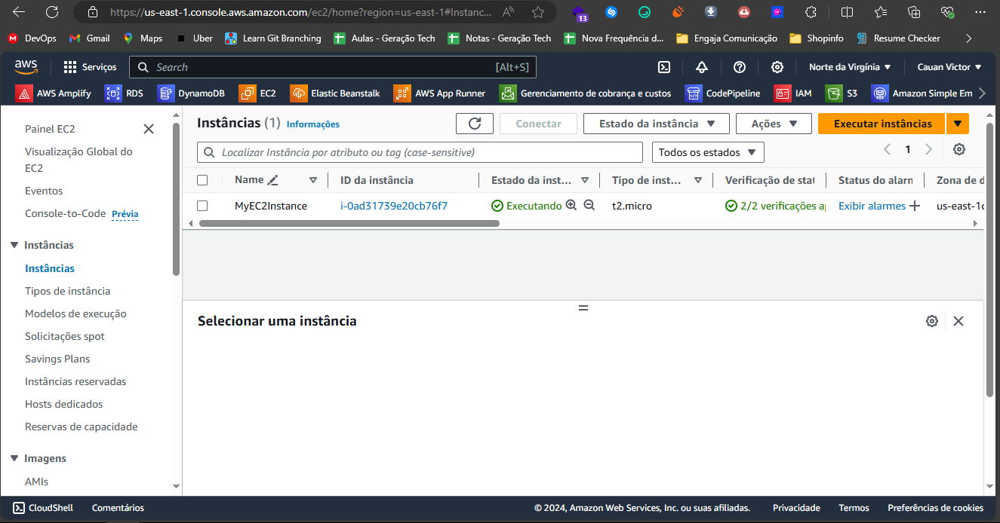
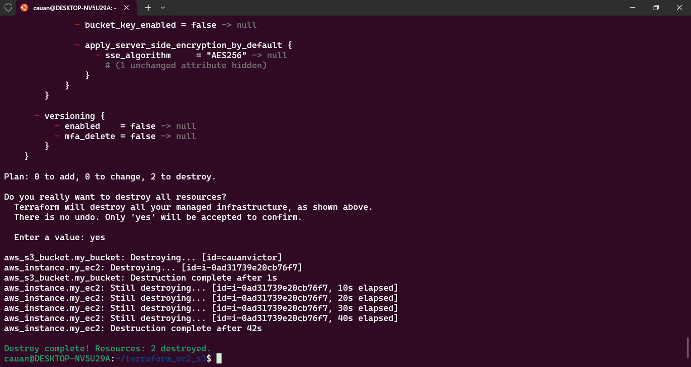

# Desafio: Criação de Instância EC2 e Bucket S3 com Terraform

Este repositório contém o código e os passos para provisionar uma instância EC2 e um bucket S3 na AWS utilizando o Terraform.

## Passos

### 1. Instalação do Terraform

Para começar, é necessário instalar o Terraform na sua máquina. Siga os passos abaixo:

```bash
# Adicionar o Repositório de Pacotes do Terraform
curl -fsSL https://apt.releases.hashicorp.com/gpg | sudo apt-key add -
sudo apt-add-repository "deb [arch=amd64] https://apt.releases.hashicorp.com $(lsb_release -cs) main"

# Atualizar os Pacotes e Instalar o Terraform
sudo apt-get update
sudo apt-get install terraform

# Verificar a Instalação
terraform -v
```

### 2. Configuração do Projeto Terraform

#### Criar o Arquivo `main.tf`

```hcl
provider "aws" {
  region = "us-east-1"
}

resource "aws_instance" "my_ec2" {
  ami           = "ami-06c68f701d8090592"
  instance_type = "t2.micro"

  tags = {
    Name = "MyEC2Instance"
  }
}

resource "aws_s3_bucket" "my_bucket" {
  bucket = "cauanvictor"

  tags = {
    Name        = "MyS3Bucket"
    Environment = "Test"
  }
}
```

### 3. Execução do Terraform

Após configurar o `main.tf`, siga os passos abaixo:

```bash
# Inicializar o Terraform
terraform init

# Visualizar o Plano de Execução
terraform plan

# Aplicar o Plano
terraform apply
```

### 4. Verificação no Console AWS

Verifique se os recursos foram criados corretamente no Console da AWS.

### 5. Limpeza dos Recursos

Para evitar custos adicionais na AWS, execute o seguinte comando após a conclusão do teste:

```bash
terraform destroy
```

---

## Capturas de Tela

Aqui estão as capturas de tela que comprovam a execução bem-sucedida de cada etapa:

1. **Inicialização do Terraform (`terraform init`)**

   

2. **Plano de Execução do Terraform (`terraform plan`)**

   

3. **Aplicação do Plano do Terraform (`terraform apply`)**

   

4. **Verificação do Bucket S3 no Console da AWS**

   

5. **Verificação da Instância EC2 no Console da AWS**

   

6. **Confirmação da Destruição dos Recursos (`terraform destroy`)**

   